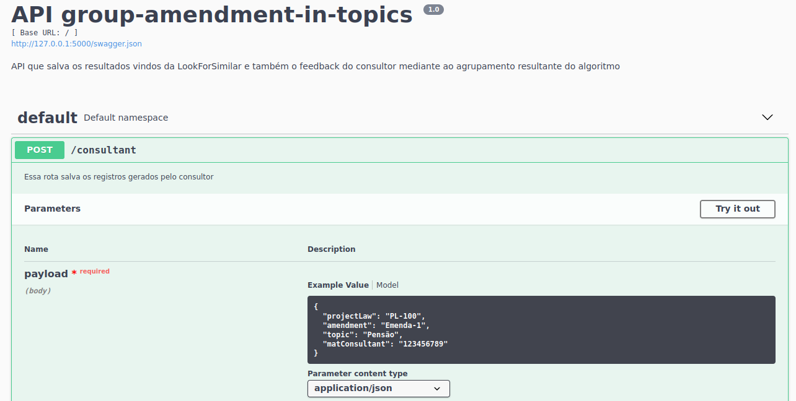

# ulysses-amendment-comparer

Groups documents according to predefined topics by a legal consultant (or user) through an information retrieval approach (BM25L). Was initially designed to support amendment documents. The input supports a single topic, a list of topics, and also desired keywords that describes a a give topic. 

## Create virtual environment

This project was developed and ested under Python==3.8

Assuming you have Anaconda installed in your system, you can create the virtual environment:

```conda create --name my_env python=3.8```

Activate your environment:

```conda activate my_env```

Go to the directory of the API service you want to install the requirements. As an example, if you want to insert topics and documents in the system as a legal consultant (user):

```cd save_amendment-topics```

installing the necessary requirements for the previous selected service directory:

```pip install -r requirements.txt```

Be aware that you will need to install the ```requirements.txt``` file for each service you intend to use.


## Service Description

That are 3 API services:

- **save-amendment-topics:** saves the amendment documents inputted in the system. In addition, saves the topics previously entered into the system by the legal consultant (user) and also the resulting topics of the grouping done by ```look-for-amendments``` service.

- **look-for-amendments:** executes the BM25L algorithm pipeline to 'group' the documents accordingly the inputted documents by the legal consultant in the system. May take a while to execute when dealing with a lot of documents. In summary, this service generate pairs of amendment and their respective topics according to what was 'predicted' by the algorithm BM25L. This service assumes that the service ```save-amendment-topics``` was already executed to feed the pipeline with the predefined topics and documents.

- **group-amendment-in-topics:** saves the resulting topics generated by the ```look-for-amendments``` service. In summary, this service saves the associated topic to a certain amendment and also saves the feedback of the legal consultant about the 'grouping' of the amendment in its respective topic.

## Executing the services 

Go to the directory of the service you want to execute:

```cd save_amendment-topics```

Run:

```python app.py```

And you can click in the disclosed link to be redirected to your browser. Note that the API endpoints are documented with **Swagger**. You can navigate through the Swagger documentation interface to run demos in your browser:


